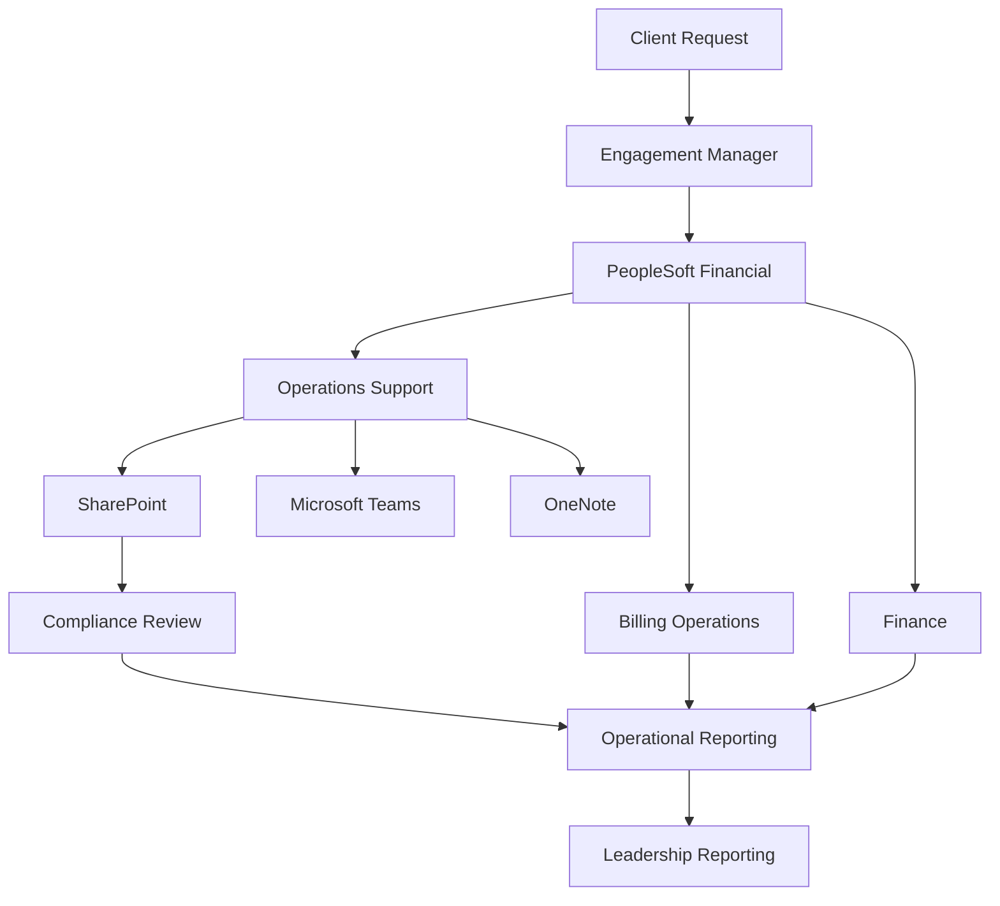
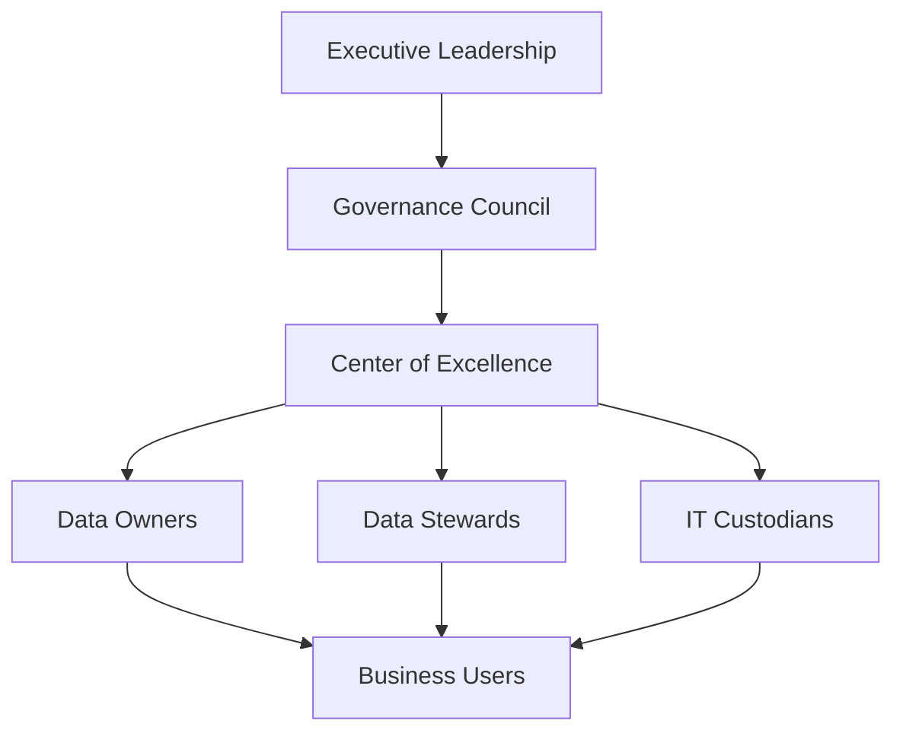
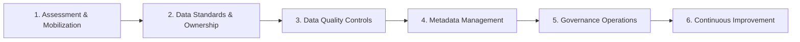

# Project Operations Data Governance Case Study

> **Portfolio project | Junior Data Governance Analyst | CDMP-aligned practice**

## Overview

This repository contains a fictional consulting case study designed to demonstrate practical skills expected of a junior Data Governance Analyst.

The scenario evaluates **Project Operations data governance for ABC Staffing Solutions**, a fictional Agile project-based staffing organization. The assessment focuses on improving reporting accuracy, strengthening compliance documentation, reducing manual reconciliation, clarifying data ownership, and establishing scalable governance practices.

The project is based on a realistic operating environment using:

- PeopleSoft Financial
- SharePoint
- Microsoft Teams
- OneNote

No confidential employer or client information is included.

## Business Problem

Project Operations relies on information distributed across multiple systems and business functions. The case study identifies six primary governance challenges:

1. Inconsistent and untimely project reporting
2. Manual reconciliation of operational and financial data
3. Duplicate and fragmented documentation
4. Cross-functional communication gaps
5. Unclear governance accountability
6. Limited metadata and data quality controls

## Project Objectives

- Assess Project Operations data quality
- Evaluate governance practices supporting Agile delivery
- Improve reporting accuracy and timeliness
- Strengthen compliance documentation
- Improve cross-functional communication
- Establish clear data ownership and stewardship
- Recommend scalable governance processes

## Governance Scope

The case study evaluates:

- Current-state processes and systems
- Stakeholders and RACI
- Data domains and systems of record
- Business glossary
- Data dictionary
- Data classification
- Data quality assessment
- Data quality rules
- Data lineage
- Governance operating model
- Metadata management
- Data stewardship
- Governance risk
- Governance KPIs
- Implementation roadmap
- Executive recommendations

## Current-State Data Flow



## Governance Operating Model



## Key Findings

| Area | Current-State Observation | Governance Response |
|---|---|---|
| Reporting | Manual reconciliation and reporting delays | Standardize sources and validation |
| Documentation | Multiple repositories and duplicate content | Establish controlled repositories |
| Ownership | Functional responsibility exists but stewardship is informal | Formalize owner/steward roles |
| Metadata | Definitions and naming practices are inconsistent | Govern glossary and dictionary |
| Data Quality | Monitoring is primarily reactive | Implement rules, scorecards, and exception management |
| Governance Metrics | Limited measurement | Implement KPI register and dashboard |

## Illustrative Data Quality Baseline

The portfolio case study uses fictional baseline values to demonstrate how a junior analyst could structure a data quality scorecard.

| Dimension | Baseline | Target |
|---|---:|---:|
| Accuracy | 92% | 98% |
| Completeness | 88% | 95% |
| Consistency | 90% | 98% |
| Timeliness | 81% | 95% |
| Uniqueness | 96% | 100% |

These figures are illustrative and are **not measurements from a real organization**.

## Executive Recommendations

1. Establish authoritative systems of record for critical data domains.
2. Formalize Data Owner and Data Steward responsibilities.
3. Standardize metadata and project documentation.
4. Implement proactive data quality rules and exception management.
5. Reduce manual reconciliation through standardization and automation.
6. Introduce governance KPIs and recurring performance reporting.
7. Use the Center of Excellence to coordinate governance standards and stewardship.
8. Establish a continuous-improvement cycle for governance maturity.

## Implementation Roadmap



## Repository Contents

```text
project-operations-data-governance-case-study/
│
├── README.md
├── docs/
│   ├── Consulting_Case_Study.md
│   └── Portfolio_Disclaimer.md
├── artifacts/
│   └── Data_Governance_Artifacts.xlsx
├── templates/
│   └── Governance_Issue_Log_Template.csv
├── LICENSE
└── .gitignore
```

### Governance Workbook

`artifacts/Data_Governance_Artifacts.xlsx` contains nine working sheets:

- Business Glossary
- Data Dictionary
- Classification
- Data Quality Assessment
- Data Quality Rules
- RACI
- Risk Register
- KPI Register
- Roadmap

## Skills Demonstrated

**Data Governance:** governance assessment, operating model design, ownership, stewardship, governance metrics

**Metadata Management:** business glossary, data dictionary, metadata standards, classification

**Data Quality:** quality dimensions, validation rules, scorecards, exception management, root-cause thinking

**Business Analysis:** stakeholder analysis, RACI, systems assessment, current-state analysis, risk assessment

**Governance Delivery:** data lineage, roadmap development, executive recommendations, governance documentation

## Project Role

**Role demonstrated:** Junior Data Governance Analyst  
**Project type:** Independent fictional portfolio case study  
**Certification context:** Designed to demonstrate practical application of CDMP-related data management concepts.

## How to Review This Project

If you are reviewing this repository as a hiring manager or recruiter, I recommend starting with:

1. This README for the business context and conclusions
2. `artifacts/Data_Governance_Artifacts.xlsx`
3. `docs/Consulting_Case_Study.md`

The workbook is the strongest evidence of hands-on governance artifact development.

## Disclaimer

ABC Staffing Solutions is fictional. The case study was created for professional portfolio and learning purposes. Systems and business processes are used only to create a realistic governance scenario. No proprietary, confidential, or employer data is included.

## Author

**Lisa Honig, CDMP Associate**

Portfolio focus: Data Governance | Data Quality | Metadata Management | Operations & Process Improvement
